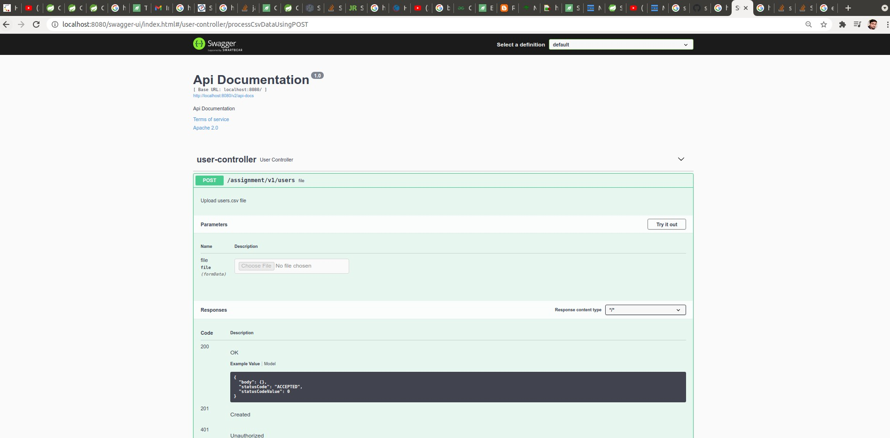
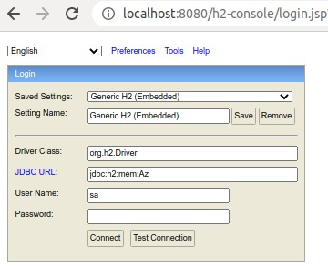
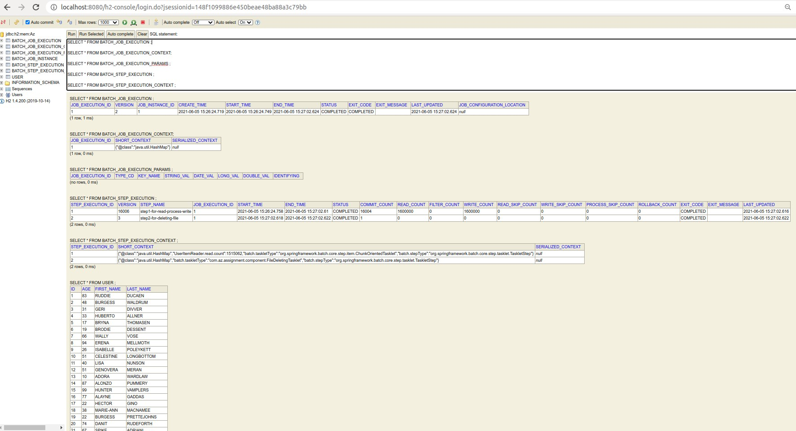
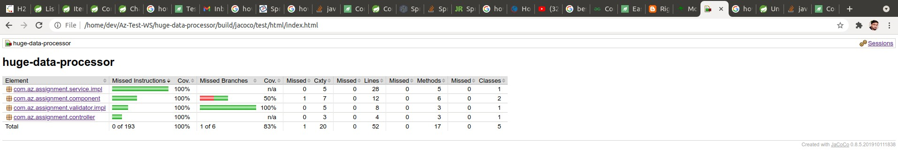
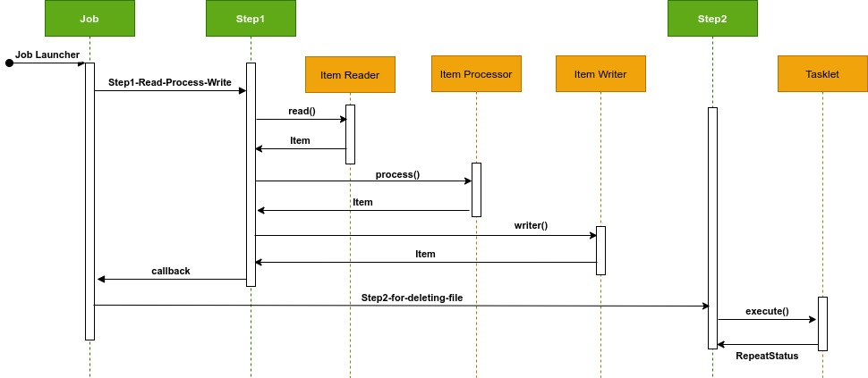

### Huge-Data-File-Processor
* It's a `spring boot microservice` to process big file efficiently and store into DB.

#### Non Functional Requirements
* There is big file approx 1 GB, we need to process and store.
* We can generate mock data from [this website](https://www.mockaroo.com/)
* Currently, we need to focus on 1 file later if required we can update the logic to support multiple files.
#### Functional Requirements
* We need to create `Spring Boot` Rest API with one end point to take file as a parameter.
* Backend we need to Process via Spring Batch to store this file into DB.
  - We should fine tune spring batch to achieve good performance with the help of `TaskExecutor`
* We need to use `H2` in-memory DB.
* We will consider `products.csv` with `columns [name, price, age]` to be uploaded.

#### How to run
* It's a gradle project simply run below commands to run
```
./gradlew clean build bootRun
```

#### Swagger-UI
* Swagger already integrated please check [this url](http://localhost:8080/swagger-ui/index.html#/product-controller/processCsvDataUsingPOST)



#### CSV file:
| name|     | price |
|----------|-----|-------|
 Apple      |     | 1     
 Samsung   |     | 5     
 OPPO |     | 3     

##### Thread configuration for TaskExecutor
* Below are my Ubuntu machine details:

| |  |
|---|---|
|Architecture        |x86_64
|CPU op-mode(s)      |32-bit, 64-bit
|Byte Order          |Little Endian
|CPU(s)              |12
|On-line CPU(s) list |0-11
|Thread(s) per core  |2
|Core(s) per socket  |6
|Socket(s)           |1
|NUMA node(s)        |1
|Vendor ID           |GenuineIntel
|CPU family          |6
|Model               |158
|Model name          |Intel(R) Core(TM) i7-8700 CPU @ 3.20GHz
|Stepping            |10

* As above mentioned I have 6 core and two thread per core possible to run in my machine.
* So I have done `TaskExecutor` on top of my machine.

```
@Bean
public TaskExecutor taskExecutor() {
    ThreadPoolTaskExecutor executor = new ThreadPoolTaskExecutor();
    executor.setCorePoolSize(12);
    executor.setMaxPoolSize(12);
    executor.setQueueCapacity(200);
    executor.setThreadNamePrefix("userThread-");
    executor.initialize();	
    return executor;
}
```
##### H2-Console
* We can cross verify data from db as well.
* Please have a look on [this url](http://localhost:8080/h2-console)


* Spring Batch creating extra table to monitor Spring Batch performance/details


  
##### Unit Test Coverage
* For Unit test coverage report please check here after project build
```
huge-data-processor/build/jacoco/test/html/index.html
```


##### Current performance test:
* 16 lack records file size 28 MB processed in 18s
* Current `csv` file have only three columns if we increase columns then 16 lack records file size will around 400 MB.
* I believe we can process 1 GB data.

##### Sequence Diagrams:


* Spring Batch Job sequence diagram:

